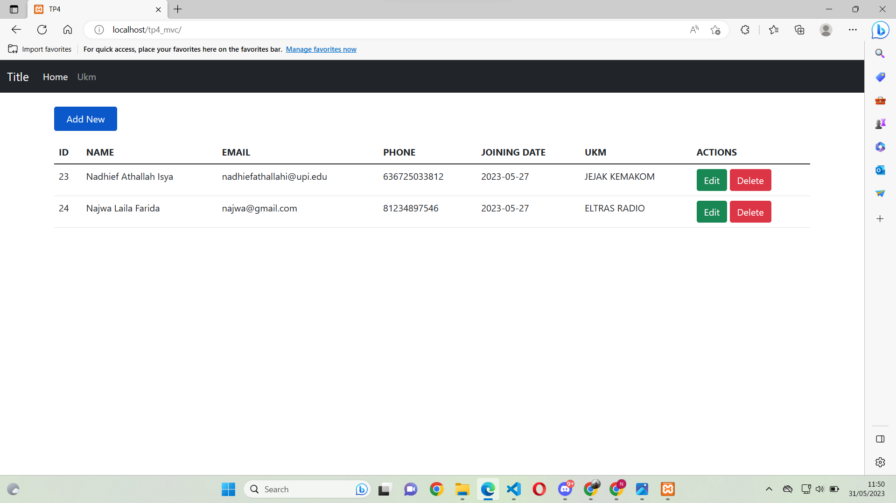
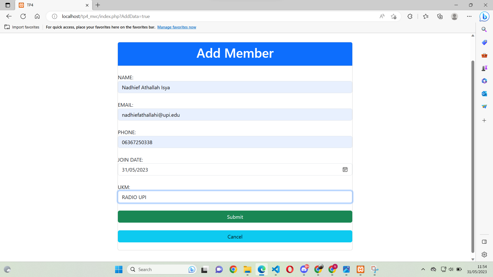
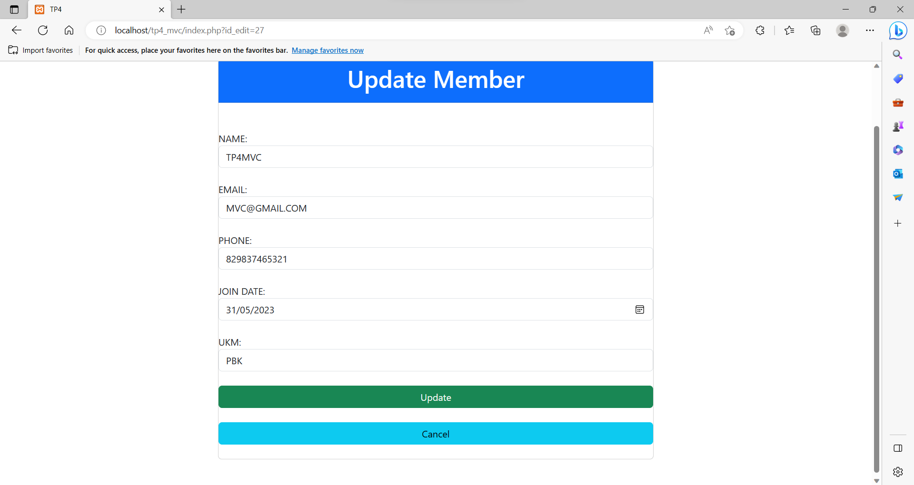
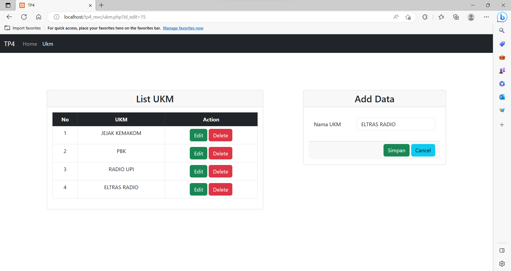

# LP9DPBO2023C2

## Janji
Saya Nadhief Athallah Isya dengan NIM 2106413 mengerjakan TP4 Praktikum DPBO dalam mata kuliah Desain Pemrograman Berorientasi Objek untuk keberkahan-Nya maka saya tidak melakukan kecurangan seperti yang telah dispesifikasikan. Aamiin.

## Deskripsi Tugas
Download Kode PHP pada link berikut ini TP MVC.
Buatlah database berdasarkan kode tersebut
Ubah arsitektur project tersebut menggunakan MVC
Tambahkan tabel baru (1 - 2) yang berelasi dengan tabel yang sudah ada
(Tabel dan Relasinya bebas ya)
Buat CRUD dari tabel  baru tersebut
Note:
Deadline: 1 Juni 2023
Program dikumpulkan pada repository publik GitHub dengan nama “TP4DPBO2023…”, dengan … diisi kelas (C1/C2).
Struktur folder:
- source_code
 	  - program
+ Screenshot
+ SQL file
video_preview.mp4 / gif
README.md
File README berisi desain program, penjelasan alur, dan dokumentasi saat program dijalankan (screenshot & record).
Tidak usah membuat UML ya gaes
Submit link repository pada form berikut: https://forms.gle/rvb1hKxbQVuYNbhKA

## Desain program

## Alur Program
1. halaman home terdapat data members secara lengkap, terdapat tombol addnew, update, dan delete members, dan navbar ukm untuk melihat data ukm
2. ketika menekan tombol addnew maka akan dipindahkan kehalaman form add Members, setelah selesai add maka akan dipindahkan ke halaman utama kembali
3. ketika menekan tombol edit maka akan dipindahkan kehalaman form namun form sudah terisi dengan data yang ingin edit sebelumnya, setelah selesai edit maka akan di pindahkan kehalaman utama kembali
4. ketika menekan tombol hapus maka data akan langsung terhapus
5. jika ingin menambahkan data ukm maka tekan navbar ukm lalu di halaman tersbut disediakan fitur addnew, edit, dan delete ukm.
## Dokumentasi

